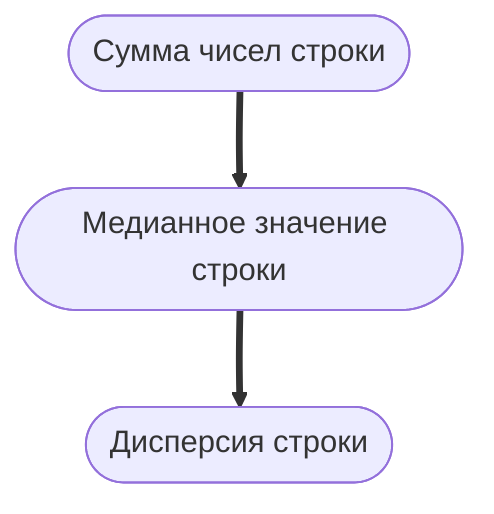

## Отчет по лабораторной работе № 2

#### № группы: `ПМ-2402`

#### Выполнил: `Абрамовский Дмитрий Антонович`

#### Вариант: `1`

### Cодержание:

- [Постановка задачи](#1-постановка-задачи)
- [Входные и выходные данные](#2-входные-и-выходные-данные)
- [Выбор структуры данных](#3-выбор-структуры-данных)
- [Математическая модель и описание алгоритмов](#4-математическая-модель-и-описание-алгоритмов)
- [Программа](#5-программа)
- [Анализ правильности решения](#6-анализ-правильности-решения)

### 1. Постановка задачи
#### Условие задачи
> Напишите программу на Java, которая выполняет следующие действия
с двумерным массивом целых чисел: 
> 1. Считывает с консоли размеры массива N и M , а затем сам массив размером N × M .
> 2. Переставляет строки массива в порядке возрастания суммы их элементов. Если суммы равны, то сравнивает медианы строк. Если медианы равны, сортирует строки по возрастанию дисперсии элементов. Если дисперсии равны, сохраняет исходный порядок. 
> 3. Находит и выводит максимальное значение среди минимальных элементов каждого столбца, а также номер столбца, в котором этот минимум был найден. 
> 4. Выводит элементы массива в виде спирали, начиная с левого верхнего элемента и двигаясь по часовой стрелке. Реализовать алгоритм с помощью одного цикла. 
> 5. Поворачивает массив на 90◦ по часовой стрелке и выводит его.

### 2. Входные и выходные данные
#### Входные данные

|                | Тип              | min значение    | max значение |
|----------------|------------------|-----------------|--------------|
| n (Число 1)    | Целое число      | -2147483648     | 2147483647   |
| m (Число 2)    | Целое число      | -2147483648     | 2147483647   |
| arr (Массив 1) | Двумерный массив | -2147483648     | 2147483647   |

#### Выходные данные
|                         | Тип                       | min значение  | max значение |
|-------------------------|---------------------------|---------------|--------------|
| Отсортированная матрица | Матрица(Двумерный массив) | -2147483648   | 2147483647   |
| Число                   | Целочисленное число       | -2147483648   | 2147483647   |
| Число                   | Целочисленное число       | -2147483648   | 2147483647   |
| Число (Через пробел)    | Целочисленное число       | -2147483648   | 2147483647   |
| Число (В виде матрицы)  | Целочисленное число       | -2147483648   | 2147483647   |

### 3. Выбор структуры данных
|     | Тип          |
|-----|--------------|
| n   | integer      |
| m   | integer      |
| arr | integer [][] |
- числа m и n - integer так как это размерность матрицы
- arr - целочисленный массив (из условия)


### 4. Математическая модель и описание алгоритмов
#### 4.1 Заполнение матрицы:
Заполнение матрицы происходит при помощи вложенного цикла считываются числа и сохраняются в матрицу.
#### 4.2 Сравнение в порядке возрастания:
В условии задачи указан следующая сортировка: 

Для дальнейшей сортировки создается двумерный массив analytics в котором хранятся массивы с данными о каждой строке.
В каждом подмассиве содержится информация о сумме, медиане, дисперсии и номере строки.

##### Поиск значений:
- Сумма - складываются все элементы строки
- Медиана - строка сортируется с помощью метода sort (Сортировка пузырьком). Затем смотрится кол-во значений в строке и выбирается либо серединное значение (если кол-во элементов нечетно), либо складываются 2 значения в середине и берется их среднее арифметическое (если кол-во четно).
- Дисперсия - в строке находится среднее арифметическое, затем полученное значение вычитается из каждого элемента строки. После этого полученные числа возводятся в квадрат. После элементы суммируют и делят на их кол-во.

После того как статистика по каждой строке собрана, данные в массиве analytics сортируются пузырьком. Сначала сортируются первые значения, при их совпадении сортируются вторые и так далее.
Затем на основе отсортированного массива analytics данные в матрице переставляются. Это реализовано при помощи изначального номера строки который сохранен.

#### 4.3 Максимальное минимальное число в столбце:
В качестве начального минимального числа берется первый элемент столбца. Затем перебираются остальные элементы столбца. После итерации внутреннего цикла минимальный элемент сравнивается с предыдущим минимальным (Это правило не применяется к первой итерации, ведь там записывается первый найденный минимум). Также параллельно сохраняется номер колонки.

#### 4.4 Вывод чисел матрицы по спирали:
Для реализации алгоритма с помощью одного цикла используется двумерный массив с направлением сдвига. Так как вывод по спирали имеет 4 направления, в массиве directions хранятся числа насколько нужно сдвигать указатель с координатами (curr_row, curr_col). Также ведется массив visited_position где булево сохраняется значение о посещении позиции. После вывода числа из изначального массива, позиция помечается флагом true, а также сдвигаются координаты. Если координаты выходят за границу, то направление движения меняется при помощи сдвига переменной direct. Каждому из 4ех значений direct присвоены свои значения для сдвига координат. Окончание вывода происходит при завершении цикла и обхода всех значений.

#### 4.5 Поворот матрицы на 90 градусов:
Для поворота массива на 90 градусов создается новая двумерная матрица. Рассмотрим новые координаты каждого элемента:
1. j: Поскольку при повороте строки становятся столбцами, индекс столбца нового элемента будет равен текущему индексу строки. То есть, элемент из строки i становится элементом в столбце j новой матрицы.
2. row - i - 1: Индекс строки нового элемента это обратный индекс текущей строки.
   - Если у нас 4 строки (индексы от 0 до 3), то:
   - Элемент из 0-й строки должен перейти в 3-й столбец.
   - Элемент из 1-й строки должен перейти во 2-й столбец.
   - Элемент из 2-й строки должен перейти в 1-й столбец.
   - Элемент из 3-й строки должен перейти в 0-й столбец.


### 5. Программа

```java
import java.util.Scanner;
public class Main {
   public static void fill_Matrix(int[][] matrix){
      Scanner scan = new Scanner(System.in);
      // Получаем количество строк и столбцов в исходной матрице
      int row = matrix.length;
      int col = matrix[0].length;
      for(int i = 0; i<row; i++){
         for(int j = 0; j<col; j++){
            // Записываем элементы в матрицу
            int number = scan.nextInt();
            matrix[i][j] = number;
         }
      }
      System.out.println();
   }

   public static void criteria_Sort(int[][] matrix){
      // Получаем количество строк и столбцов в исходной матрице
      int m = matrix.length;
      int n = matrix[0].length;
      // Создаем массив с аналитикой каждой строки
      // [сумма, медиана, дисперсия, изначальный номер строки в матрице] - структура каждого элемента
      double [][] analytics = new double[m][4];
      for(int i = 0; i<m; i++){
         int [] row = new int[n];
         // Сохраняем исходную позицию
         analytics[i][3] = i;
         for (int j = 0; j<n; j++){
            row[j] = matrix[i][j];
            // Считаем сумму строки
            analytics[i][0] += matrix[i][j];
         }
         // Сортируем строку для поиска медианы
         sort(row);
         // Ищем медиану
         if(n%2==0){
            analytics[i][1] = (double) (row[row.length / 2 - 1] + row[row.length / 2]) / 2;
         }else{
            analytics[i][1] = row[row.length/2];
         }
         // Находим среднее арифметическое
         double srd = analytics[i][0] / n;
         double dispers = 0;
         for(int j = 0; j <n; j++){
            // Считаем сумму дисперсии каждого элемента
            dispers +=  Math.pow(row[j]-srd,2);
         }
         // Сохраняем дисперсию строки
         analytics[i][2] = dispers/n;
      }
      // Сортируем полученные данные по алгоритму из задания
      sort_Matrix(analytics);
      int counter = 0;
      int [][] new_arr = new int[m][n];
      for(int i = 0; i<m; i++){
         for(int j = 0; j<n; j++){
            new_arr[i][j] = matrix[i][j];
         }
      }
      // Обновляем изначальный массив
      for(int i = 0; i<m; i++){
         int numb = (int) analytics[counter][3];
         matrix[counter] = new_arr[numb];
         counter+=1;
      }
   }

   public static void sort(int[] matrix){
      // Пузырьковая сортировка
      int len = matrix.length;
      while(len!=0){
         int index = 0;
         for(int i = 1;i<len;i++){
            // Сравниваем элементы массива и если предыдущий больше нынешнего, меняем их местами
            if(matrix[i-1] > matrix[i]) {
               int number = matrix[i - 1];
               matrix[i - 1] = matrix[i];
               matrix[i] = number;
               index = i;
            }
         }
         // Максимальный элемент гарантированно уйдет в конец, обновляем длину неотсортированной части
         len = index;
      }
   }

   public static void sort_Matrix(double[][] matrix){
      // Задаем длину массива в переменную
      int len = matrix.length;
      while(len!=0){
         int index = 0;
         for(int i = 1;i<len;i++){
            // Сортируем матрицу по первому элементу каждой строки
            if(matrix[i-1][0] > matrix[i][0]) {
               double [] number = matrix[i - 1];
               matrix[i - 1] = matrix[i];
               matrix[i] = number;
               index = i;
            }else if(matrix[i-1][0] == matrix[i][0]){
               // Если они равны сортируем по второму элементу
               if(matrix[i-1][1] > matrix[i][1]){
                  double [] number = matrix[i - 1];
                  matrix[i - 1] = matrix[i];
                  matrix[i] = number;
                  index = i;
               }else if (matrix[i-1][1] == matrix[i][1]){
                  // Если вторые элементы равны, сортируем по третьему
                  if(matrix[i-1][2] > matrix[i][2]){
                     double [] number = matrix[i - 1];
                     matrix[i - 1] = matrix[i];
                     matrix[i] = number;
                     index = i;
                  }
               }
            }
         }
         // Так как после сортировки максимальный элемент уйдет в конец, перезаписываем длину неотсортированной части
         len = index;
      }
   }

   public static void max_min(int[][] matrix){
      // Получаем количество строк и столбцов в исходной матрице
      int m = matrix.length;
      int n = matrix[0].length;
      // Возьмем за исходный элемент первый элемент первого столбца
      int max_min = 0;
      int column = 1;
      for(int i = 0; i<n; i++){
         // Ищем минимальный элемент столбца
         int min = matrix[0][i];
         for(int j = 0; j<m; j++){
            if(matrix[j][i] < min){
               min = matrix[j][i];
            }
         }
         // Сравниваем найденный минимальный элемент с предыдущими
         // Если это первое сравнение, то записываем первый найденный минимум
         if(i!=0){
            if(min>max_min){
               // Обновляем его если он больше предыдущего
               max_min = min;
               column= i+1;
            }
         }else{
            max_min = min;

         }
      }
      // Выводим элемент и его координаты (Первый подходящий)
      System.out.println("Максимальный элемент среди минимальных: " + max_min);
      System.out.println("Элемент был найден в " + column + " столбце");
      System.out.println();
   }

   public static void spiralPrint(int[][] matrix) {
      // Получаем количество строк и столбцов в исходной матрице
      int row = matrix.length;
      int col = matrix[0].length;
      // Получаем кол-во всех элементов в матрице
      int elements = row * col;
      // Задаем направления
      int[][] directions = {{0, 1}, {1, 0}, {0, -1}, {-1, 0}}; // 1. Право 2. Вниз 3. Влево 4. Вниз
      // Задаем исходное направление и координаты указателя
      int direct = 0;
      int curr_row = 0;
      int curr_col = 0;
      boolean[][] visited_position = new boolean[row][col];
      for (int i = 0; i < elements; i++) {
         // Выводим элемент
         System.out.printf("%3d",matrix[curr_row][curr_col]);
         // Помечаем элемент как пройденный
         visited_position[curr_row][curr_col] = true;
         // Считаем следующий элемент
         int next_row = curr_row + directions[direct][0];
         int next_col = curr_col + directions[direct][1];
         // Смотрим не вышли ли мы за границу матрицы
         if (next_row < 0 || next_row >= row || next_col < 0 || next_col >= col || visited_position[next_row][next_col]) {
            //Если вышли, то меняем направление и считаем новые координаты
            direct = (direct + 1) % 4;
            next_row = curr_row + directions[direct][0];
            next_col = curr_col + directions[direct][1];
         }
         // Сдвигаем указатель
         curr_row = next_row;
         curr_col = next_col;
      }
      System.out.println();
      System.out.println();
   }

   public static int[][] rotate_Matrix(int[][] matrix) {
      // Получаем количество строк и столбцов в исходной матрице
      int row = matrix.length;
      int col = matrix[0].length;
      // Создаем новую матрицу
      int[][] new_matrix = new int[col][row];
      // Проходим по каждой строке исходной матрицы
      for (int i = 0; i < row; i++) {
         // Проходим по каждому столбцу исходной матрицы
         for (int j = 0; j < col; j++) {
            // Заполняем новую матрицу, поворачивая исходную на 90 градусов по часовой стрелке
            new_matrix[j][row - i - 1] = matrix[i][j];
         }
      }
      // Возвращаем новую матрицу, которая является поворотом исходной на 90 градусов по часовой стрелке
      return new_matrix;
   }

   public static void print_Matrix(int[][] matrix) {
      // Получаем количество строк и столбцов в исходной матрице
      int row = matrix.length;
      int col = matrix[0].length;
      for (int i = 0; i < row; i++) {
         for (int j = 0; j < col; j++) {
            // Выводим элементы матрицы
            System.out.printf("%3d", matrix[i][j]);
         }
         System.out.println();
      }
      System.out.println();
   }

   public static void main(String[] args){
      Scanner scan = new Scanner(System.in);
      int n = scan.nextInt();
      int m = scan.nextInt();
      int [][] arr = new int[m][n];
      if(n>0&&m>0){
         fill_Matrix(arr);
         criteria_Sort(arr);
         System.out.println("Отсортированная матрица:\n");
         print_Matrix(arr);
         max_min(arr);
         System.out.println("Вывод элементов матрицы по спирали начиная с левого верхнего элемента:\n");
         spiralPrint(arr);
         System.out.println("Повернутая на 90 градусов матрица:\n");
         print_Matrix(rotate_Matrix(arr));
      }else{
         System.out.println("Это не матрица");
      }
   }
}
```

 ### 5.1 Программа без использования методов
 ``` java
import java.util.Scanner;
public class Main {
    public static void main(String[] args) {
        Scanner scan = new Scanner(System.in);
        int n = scan.nextInt();
        int m = scan.nextInt();
        int [][] matrix = new int[m][n];
        if(n>0&&m>0){
            // ЗАПИСЬ ЭЛЕМЕНТОВ
            int row = matrix.length;
            int col = matrix[0].length;
            for(int i = 0; i<row; i++){
                for(int j = 0; j<col; j++){
                    // Записываем элементы в матрицу
                    int number = scan.nextInt();
                    matrix[i][j] = number;
                }
            }
            System.out.println();

            // СОРТИРОВКА МАССИВА ПО УСЛОВИЮ
            // Создаем массив с аналитикой каждой строки
            // [сумма, медиана, дисперсия, изначальный номер строки в матрице] - структура каждого элемента
            double [][] analytics = new double[m][4];
            for(int i = 0; i<m; i++){
                int [] row_arr = new int[n];
                // Сохраняем исходную позицию
                analytics[i][3] = i;
                for (int j = 0; j<n; j++){
                    row_arr[j] = matrix[i][j];
                    // Считаем сумму строки
                    analytics[i][0] += matrix[i][j];
                }
                // Сортируем строку для поиска медианы
                int len = row_arr.length;
                while(len!=0) {
                    int index = 0;
                    for (int j = 1; j < len; j++) {
                        // Сравниваем элементы массива и если предыдущий больше нынешнего, меняем их местами
                        if (row_arr[j - 1] > row_arr[j]) {
                            int number = row_arr[j - 1];
                            row_arr[j - 1] = row_arr[j];
                            row_arr[j] = number;
                            index = j;
                        }
                    }
                    // Максимальный элемент гарантированно уйдет в конец, обновляем длину неотсортированной части
                    len = index;
                }
                // Ищем медиану
                if(n%2==0){
                    analytics[i][1] = (double) (row_arr[row_arr.length / 2 - 1] + row_arr[row_arr.length / 2]) / 2;
                }else{
                    analytics[i][1] = row_arr[row_arr.length/2];
                }
                // Находим среднее арифметическое
                double srd = analytics[i][0] / n;
                double dispers = 0;
                for(int j = 0; j <n; j++){
                    // Считаем сумму дисперсии каждого элемента
                    dispers +=  Math.pow(row_arr[j]-srd,2);
                }
                // Сохраняем дисперсию строки
                analytics[i][2] = dispers/n;
            }
            // Сортируем полученные данные по алгоритму из задания
            int len = analytics.length;
            while(len!=0){
                int index = 0;
                for(int i = 1;i<len;i++){
                    // Сортируем матрицу по первому элементу каждой строки
                    if(analytics[i-1][0] > analytics[i][0]) {
                        double[] number = analytics[i - 1];
                        analytics[i - 1] = analytics[i];
                        analytics[i] = number;
                        index = i;
                    }else if(analytics[i-1][0] == analytics[i][0]){
                        // Если они равны сортируем по второму элементу
                        if(analytics[i-1][1] > analytics[i][1]){
                            double[] number = analytics[i - 1];
                            analytics[i - 1] = analytics[i];
                            analytics[i] = number;
                            index = i;
                        }else if (matrix[i-1][1] == matrix[i][1]){
                            // Если вторые элементы равны, сортируем по третьему
                            if(analytics[i-1][2] > analytics[i][2]){
                                double[] number = analytics[i - 1];
                                analytics[i - 1] = analytics[i];
                                analytics[i] = number;
                                index = i;
                            }
                        }
                    }
                }
                // Так как после сортировки максимальный элемент уйдет в конец, перезаписываем длину неотсортированной части
                len = index;
            }
            int counter = 0;
            int [][] new_arr = new int[m][n];
            for(int i = 0; i<m; i++){
                for(int j = 0; j<n; j++){
                    new_arr[i][j] = matrix[i][j];
                }
            }
            // Обновляем изначальный массив
            for(int i = 0; i<m; i++) {
                int numb = (int) analytics[counter][3];
                matrix[counter] = new_arr[numb];
                counter+=1;
            }
            //ВЫВОД МАТРИЦЫ
            for (int i = 0; i < row; i++) {
                for (int j = 0; j < col; j++) {
                    // Выводим элементы матрицы
                    System.out.printf("%3d", matrix[i][j]);
                }
                System.out.println();
            }
            System.out.println();
            // ПОИСК МИНИМУМА
            // Возьмем за исходный элемент первый элемент первого столбца
            int max_min = 0;
            int column = 1;
            for(int i = 0; i<n; i++){
                // Ищем минимальный элемент столбца
                int min = matrix[0][i];
                for(int j = 0; j<m; j++){
                    if(matrix[j][i] < min){
                        min = matrix[j][i];
                    }
                }
                // Сравниваем найденный минимальный элемент с предыдущими
                // Если это первое сравнение, то записываем первый найденный минимум
                if(i!=0){
                    if(min>max_min){
                        // Обновляем его если он больше предыдущего
                        max_min = min;
                        column= i+1;
                    }
                }else{
                    max_min = min;

                }
            }
            // Выводим элемент и его координаты (Первый подходящий)
            System.out.println("Максимальный элемент среди минимальных: " + max_min);
            System.out.println("Элемент был найден в " + column + " столбце");
            System.out.println();
            //ВЫВОД СПИРАЛИ
            System.out.println("Вывод элементов матрицы по спирали начиная с левого верхнего элемента:\n");
            // Получаем кол-во всех элементов в матрице
            int elements = row * col;
            // Задаем направления
            int[][] directions = {{0, 1}, {1, 0}, {0, -1}, {-1, 0}}; // 1. Право 2. Вниз 3. Влево 4. Вниз
            // Задаем исходное направление и координаты указателя
            int direct = 0;
            int curr_row = 0;
            int curr_col = 0;
            boolean[][] visited_position = new boolean[row][col];
            for (int i = 0; i < elements; i++) {
                // Выводим элемент
                System.out.printf("%3d",matrix[curr_row][curr_col]);
                // Помечаем элемент как пройденный
                visited_position[curr_row][curr_col] = true;
                // Считаем следующий элемент
                int next_row = curr_row + directions[direct][0];
                int next_col = curr_col + directions[direct][1];
                // Смотрим не вышли ли мы за границу матрицы
                if (next_row < 0 || next_row >= row || next_col < 0 || next_col >= col || visited_position[next_row][next_col]) {
                    //Если вышли, то меняем направление и считаем новые координаты
                    direct = (direct + 1) % 4;
                    next_row = curr_row + directions[direct][0];
                    next_col = curr_col + directions[direct][1];
                }
                // Сдвигаем указатель
                curr_row = next_row;
                curr_col = next_col;
            }
            System.out.println();
            System.out.println();
            System.out.println("Повернутая на 90 градусов матрица:\n");
            // Создаем новую матрицу
            int[][] new_matrix = new int[col][row];
            // Проходим по каждой строке исходной матрицы
            for (int i = 0; i < row; i++) {
                // Проходим по каждому столбцу исходной матрицы
                for (int j = 0; j < col; j++) {
                    // Заполняем новую матрицу, поворачивая исходную на 90 градусов по часовой стрелке
                    new_matrix[j][row - i - 1] = matrix[i][j];
                }
            }
            for (int i = 0; i < row; i++) {
                for (int j = 0; j < col; j++) {
                    // Выводим элементы матрицы
                    System.out.printf("%3d", new_matrix[i][j]);
                }
                System.out.println();
            }
            System.out.println();
        }else{
            System.out.println("Это не матрица");
        }

    }
}

 ```

### 6. Анализ правильности решения
#### Проведем тесты 

1. ##### n=0, m=0
Отсутствие матрицы
- Input:
    ```
  0 0
    ```
- Output:
    ```
    Это не матрица
    ```

2. ##### n=1, m=1
Матрица с одним элементом
- Input:
    ```
  1 1
  1
    ```
- Output:
    ```
    Отсортированная матрица:

  1

   Максимальный элемент среди минимальных: 1
   Элемент был найден в 1 столбце

   Вывод элементов матрицы по спирали начиная с левого верхнего элемента:

   1

   Повернутая на 90 градусов матрица:

   1
    ```

3. ##### n=3, m=2
Матрица с большим кол-вом строк
- Input:
    ```
  3 2
  1 2 3
  4 5 6
    ```
- Output:
    ```
    Отсортированная матрица:

  1  2  3
  4  5  6

   Максимальный элемент среди минимальных: 3
   Элемент был найден в 3 столбце
   
   Вывод элементов матрицы по спирали начиная с левого верхнего элемента:
   
   1  2  3  6  5  4
   
   Повернутая на 90 градусов матрица:
   
   4  1
   5  2
   6  3
    ```
Программа отработала штатно. Элементы были отсортированы по сумме и поворот произошел успешно

4. ##### n=2, m=3
Матрица с большим кол-вом столбцов
- Input:
    ```
  2 3
   8 1 3 6 7 2
    ```
- Output:
    ```
   Отсортированная матрица:
   
   3  6
   7  2
   8  1
   
   Максимальный элемент среди минимальных: 3
   Элемент был найден в 1 столбце
   
   Вывод элементов матрицы по спирали начиная с левого верхнего элемента:
   
   3  6  2  1  8  7
   
   Повернутая на 90 градусов матрица:
   
   8  7  3
   1  2  6
    ```
Программа отработала штатно. Элементы сравнивались по медианам, так как суммы равны
4. ##### n=4, m=4
Квадратная матрицы
- Input:
    ```
   4 4
  5 2 2 3
   3 2 2 10
   10 5 7 2
   1 1 1 1
    ```
- Output:
    ```
  Отсортированная матрица:

  1  1  1  1
  5  2  2  3
  3  2  2 10
   10  5  7  2
   
   Максимальный элемент среди минимальных: 1
   Элемент был найден в 1 столбце
   
   Вывод элементов матрицы по спирали начиная с левого верхнего элемента:
   
   1  1  1  1  3 10  2  7  5 10  3  5  2  2  2  2
   
   Повернутая на 90 градусов матрица:
   
   10  3  5  1
   5  2  2  1
   7  2  2  1
   2 10  3  1

    ```
  Немного о сортировке в этом примере:
```
Суммы и медианы этих элементов равны поэтому сравнение идет по дисперсии
   2 2 3 5 
   2 2 3 10 
```

  

